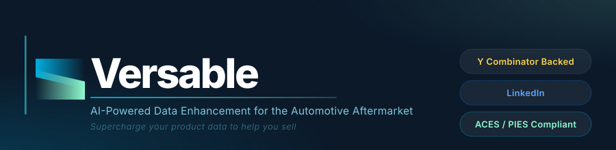

<div align="center">
  <a href="https://versableai.com">
    
  </a>
</div>

<br/>

<div align="center">

[](https://versableai.com)
[](https://app.versable.ai)
[](https://www.linkedin.com/company/versableai)
[](https://ycombinator.com)

</div>

---

## About Versable

Versable is an **AI-powered product data enhancement platform** built specifically for the automotive aftermarket parts industry. We turn incomplete, inaccurate, and non-compliant product listings into market-ready content — automatically, at scale, without hallucinations.

> _Supercharge your product data to help you sell._

The auto parts industry runs on structured data standards (ACES/PIES), but most sellers struggle with messy supplier spreadsheets, missing attributes, and non-compliant listings. Versable eliminates that manual work. Built on millions of parts data points, trained end-to-end on automotive aftermarket catalogs, and deployed with programmatic guardrails to ensure accuracy at every step.

**As seen in:** Y Combinator · AutoCare Association · Forbes · USA Today · LA Weekly

---

## What We Build

| Module                      | What it does                                                            |
| --------------------------- | ----------------------------------------------------------------------- |
| **Data Normalization**      | Merges multiple supplier spreadsheets into ACES/PIES-compliant catalogs |
| **AI Extraction**           | Adaptive scraper that auto-completes product data from any source       |
| **Content Generation**      | Creates SEO-optimized, platform-ready descriptions with customization   |
| **Image Enhancement**       | Resizes, enhances, or generates new product images from the database    |
| **Programmatic Guardrails** | Verification layer that eliminates AI hallucinations on every output    |

**Supported formats:** PIES XML · ACES XML · JSON · Excel · Unstructured spreadsheets

---

## Who We Serve

| Audience                         | Use Case                                                           |
| -------------------------------- | ------------------------------------------------------------------ |
| **Manufacturers**                | Audit data gaps, avoid partner rejections, enforce catalog quality |
| **Retailers & Distributors**     | Streamline supplier onboarding and data normalization at scale     |
| **Marketplaces & Buying Groups** | Enforce ACES/PIES compliance at ingestion, reduce bad listings     |
| **Sales Representatives**        | Surface accurate part fitment and product data instantly           |

---

## Infrastructure

```
  Browser (HTTPS)
       │
       ▼
  ┌─────────────────────────────────────────────────────┐
  │  Vercel  ·  app.versable.ai                         │
  │                                                     │
  │   ┌─────────────┐  ┌──────────────────┐  ┌───────┐ │
  │   │  Next.js 16 │  │ /api/engine/*    │  │ Next  │ │
  │   │  React 19   │  │ proxy → Render   │  │ Auth  │ │
  │   └─────────────┘  └────────┬─────────┘  └───────┘ │
  └────────────────────────────-│───────────────────────┘
                                │  server-side rewrite
                                ▼
  ┌─────────────────────────────────────────────────────┐
  │  Render  ·  FastAPI (Python)                        │
  │                                                     │
  │   ┌──────────────────────┐  ┌──────────────────┐   │
  │   │  FastAPI + pipelines │  │  Credit Worker   │   │
  │   │  (AI / scraping)     │  │  (Node.js + Redis│   │
  │   └──────────────────────┘  └──────────────────┘   │
  └────────────┬──────────────────────┬─────────────────┘
               │                      │
       ┌───────┴───────┐      ┌───────┴────────┐
       │  Shared Data  │      │ External Svcs  │
       │               │      │                │
       │ ┌──────────┐  │      │ ┌────────────┐ │
       │ │PostgreSQL│  │      │ │   Stripe   │ │
       │ └──────────┘  │      │ └────────────┘ │
       │ ┌──────────┐  │      │ ┌────────────┐ │
       │ │  Redis   │  │      │ │  AWS SES   │ │
       │ └──────────┘  │      │ └────────────┘ │
       │ ┌──────────┐  │      │ ┌────────────┐ │
       │ │  AWS S3  │  │      │ │  Sentry †  │ │
       │ └──────────┘  │      │ └────────────┘ │
       └───────────────┘      └────────────────┘

  † Sentry enabled on production branch (frontend-release) only

  Local dev:  localhost:3006 (Next.js)  ──▶  localhost:8001 (FastAPI)
  Staging:    development branch → dedicated pre-prod environment
  Production: frontend-release branch → app.versable.ai
```

---

## Tech Stack

<table>
<tr>
<td><strong>Frontend</strong></td>
<td>Next.js 16 · React 19 · TypeScript · Tailwind CSS · DaisyUI · Jotai · TanStack Query</td>
</tr>
<tr>
<td><strong>Backend</strong></td>
<td>FastAPI · Python · Drizzle ORM · PostgreSQL · Redis</td>
</tr>
<tr>
<td><strong>Infrastructure</strong></td>
<td>Vercel (frontend) · Render (backend) · AWS S3 (storage) · AWS SES (email)</td>
</tr>
<tr>
<td><strong>Payments</strong></td>
<td>Stripe · Credit worker (Node.js)</td>
</tr>
<tr>
<td><strong>Observability</strong></td>
<td>Sentry · logger-crab (internal — Rust + axum + SQLite + S3)</td>
</tr>
<tr>
<td><strong>Auth</strong></td>
<td>NextAuth v4 · NextAuth with Drizzle adapter</td>
</tr>
</table>

---

## Repositories

| Repo                                                                         | Description                                             | Visibility |
| ---------------------------------------------------------------------------- | ------------------------------------------------------- | ---------- |
| [`enhancement-product`](https://github.com/versable-git/enhancement-product) | Core enhancement platform — Next.js 16 + FastAPI        | Private    |
| [`logger-crab`](https://github.com/versable-git/logger-crab)                 | Centralized logging service — Rust + axum + SQLite + S3 | Private    |
| [`organization-state`](https://github.com/versable-git/organization-state)   | Company status, roadmap, and internal happenings        | Private    |
| [`vcdb-check`](https://github.com/versable-git/vcdb-check)                   | VCDB data validation scripts                            | Private    |
| [`data-quality-trial`](https://github.com/versable-git/data-quality-trial)   | Public data quality tooling and samples                 | Public     |
| [`agent-studio`](https://github.com/versable-git/agent-studio)               | AI agent development workspace                          | Private    |

---

## Team

<table>
<tr>
<td align="center" width="200">
  <br/>
  <strong>Christina Seong</strong><br/>
  <sub><a href="mailto:tina@versable.ai">tina@versable.ai</a></sub>
</td>
<td align="center" width="200">
  <br/>
  <strong>Von Villamor</strong><br/>
  <sub><a href="mailto:von@versable.ai">von@versable.ai</a></sub>
</td>
<td align="center" width="200">
  <br/>
  <strong>Aakarsh Chopra</strong><br/>
  <sub><a href="mailto:aakarsh@versable.ai">aakarsh@versable.ai</a></sub>
</td>
</tr>
</table>

---

<div align="center">
  <sub>
    Built for the automotive aftermarket &nbsp;·&nbsp;
    <a href="https://versableai.com">versableai.com</a> &nbsp;·&nbsp;
    <a href="https://www.linkedin.com/company/versableai">LinkedIn</a>
    <br/><br/>
    <strong>Updated:</strong> 2026-04-18
  </sub>
</div>
