<div align="center">
  <a href="https://versableai.com">
    
  </a>
</div>

<br/>

<div align="center">

[](https://versableai.com)
[](https://app.versable.ai)
[](https://www.linkedin.com/company/versableai)
[](https://ycombinator.com)

</div>

---

## About Versable

Versable builds AI-powered product data tools for the **automotive aftermarket**. It started with one platform that turns incomplete, non-compliant listings into market-ready content, and it now spans several products, client builds for named partners, and the shared platform they run on.

> _Supercharge your product data to help you sell._

The auto parts industry runs on structured data standards (ACES/PIES), but most sellers work from messy supplier spreadsheets with missing attributes. Versable removes that manual work, with programmatic guardrails checking every output.

**As seen in:** Y Combinator · AutoCare Association · Forbes · USA Today · LA Weekly

---

## Where things live

| Place | What it is |
| --- | --- |
| [app.versable.ai](https://app.versable.ai) | The Versable app |
| [versableai.com](https://versableai.com) | Company site |
| [tech.versable.ai](https://tech.versable.ai) | Team docs hub: every repo's docs in one place (team sign-in) |

---

## What we build

Every active repo, grouped by what it is and sorted by how much it is used (census of 2026-09-30).

### Products

Customer-facing, deployed, in active development.

| Repo | What it is | Activity |
| --- | --- | --- |
| [`enhancement-product`](https://github.com/versable-git/enhancement-product) | The core Versable product (app.versable.ai): sellers upload a product spreadsheet and get marketplace-ready data back via AI agents, scrapers and image tooling. | heavy |
| [`speedway`](https://github.com/versable-git/speedway) | Parts-catalog builder: turns mismatched supplier spreadsheets/XML feeds into one clean catalog with field-level provenance (speedway.versable.ai). | heavy |
| [`versable-forge-v6`](https://github.com/versable-git/versable-forge-v6) | Workflow Console (App V6), first app on the Foundry contract; deployed to forge.dev.versable.ai. | heavy |
| [`vista-website`](https://github.com/versable-git/vista-website) | Marketing site for govista.io: landing page, blog, legal pages (Next 16). | moderate |

### Client builds

Built for a named client and running for them.

| Repo | What it is | Activity |
| --- | --- | --- |
| [`walmart-mvp`](https://github.com/versable-git/walmart-mvp) | AI listing-enhancement MVP for Walmart Marketplace sellers (FastAPI + React + Gemini), deployed at walmart.versableplatforms.com. | heavy |
| [`winhere-pim`](https://github.com/versable-git/winhere-pim) | Product Information Manager for Winhere Brake Parts: China factory uploads, US team validates and exports; live at winhere.versableplatforms.com. | heavy |

### Platform

Shared services and kits the products are built on.

| Repo | What it is | Activity |
| --- | --- | --- |
| [`extractor-webserver`](https://github.com/versable-git/extractor-webserver) | Automation orchestrator: crash-resumable state machine from job received to delivered, for the extractor scrapers. | heavy |
| [`slack-automation`](https://github.com/versable-git/slack-automation) | Monorepo of Slack automations plus the shared CI kit, PR bot, docs portal and deploy-proof workflows other repos call. | heavy |
| [`versable-builder`](https://github.com/versable-git/versable-builder) | Design canon and UI kit ('13 traits' design language), app templates and publish-kit workflow used to build the other apps. | heavy |
| [`versable-foundry`](https://github.com/versable-git/versable-foundry) | The contract every Silica module is built against: auth, reference-data and runner services plus docs; forge and others consume it. | heavy |
| [`extractor`](https://github.com/versable-git/extractor) | Standalone scrape runner extracted from the old backend; scrapers and PRDs for the scraper overhaul. | moderate |
| [`extractor-regression`](https://github.com/versable-git/extractor-regression) | Periodic regression service that re-scrapes known parts to catch silently broken scrapers. | moderate |
| [`internal`](https://github.com/versable-git/internal) | Versable Internal: passport SSO ('Sign in with Versable') and admin app for internal tools. | moderate |
| [`services-api`](https://github.com/versable-git/services-api) | Shared jobs API: POST /jobs stores a payload and fans out per-item Cloud Tasks; API keys and CLI. | moderate |
| [`data-extraction`](https://github.com/versable-git/data-extraction) | Older FastAPI scraping service with durable workflow orchestration (resolve row to URL, extract structured data). | light |
| [`logger-crab`](https://github.com/versable-git/logger-crab) | Centralized logging for the Versable stack (Rust, axum, SQLite, S3); README calls it 'crude V1, deliberately disposable'. | light |

### Internal tools

Bots, fixtures, scripts and notes that keep the team moving.

| Repo | What it is | Activity |
| --- | --- | --- |
| [`organization-state`](https://github.com/versable-git/organization-state) | Company status notes: engineering-chat and meeting logs. | moderate |
| [`pr-claude-testbed`](https://github.com/versable-git/pr-claude-testbed) | Calibrated fixtures for the PR review bot; README says 'not a product'. | moderate |
| [`knowledge-base`](https://github.com/versable-git/knowledge-base) | Documentation-only OKF knowledge bundle for the Versable auto-parts data stack (extractors, speedway, enhancement-product). | light |
| [`passport-sso-demo`](https://github.com/versable-git/passport-sso-demo) | Tiny zero-dependency demo of 'Sign in with Versable' passport SSO. | light |
| [`pr-board-smoketest`](https://github.com/versable-git/pr-board-smoketest) | Smoke-test fixture with two workflows calling the shared pr-claude and docs-publish workflows. | light |
| [`vcdb-check`](https://github.com/versable-git/vcdb-check) | Scripts that validate supplier data against the VCDB vehicle database. | light |
| [`.github`](https://github.com/versable-git/.github) | Versable GitHub organization profile (public README). | none |

### Labs

Prototypes and experiments; some graduate, some do not.

| Repo | What it is | Activity |
| --- | --- | --- |
| [`versable-harness`](https://github.com/versable-git/versable-harness) | Portable TypeScript workflow agent and visual workflow app; deployed to Cloud Run. | moderate |
| [`enhancement-agent-v3-poc`](https://github.com/versable-git/enhancement-agent-v3-poc) | REPL-native auto-parts listing-enhancement engine with a scored eval harness. | light |
| [`pim`](https://github.com/versable-git/pim) | Vendor-neutral aftermarket product hub: ingest, human-review conflicts, PIES/ACES, per-partner export gates. | light |
| [`repl-agent`](https://github.com/versable-git/repl-agent) | Gemini-backed data agent with a persistent Python REPL as working memory; JEGS part-type mapping example. | light |

<details>
<summary>Dormant and archived (6 dormant, 14 archived)</summary>

| Repo | What it is | Activity |
| --- | --- | --- |
| [`product-repository`](https://github.com/versable-git/product-repository) | Old product repository with frontend, repo and services (218 commits, Vercel). | moderate |
| [`Application-Backend`](https://github.com/versable-git/Application-Backend) | Django backend of the original Vista application (v1 stack). | none |
| [`Application-Frontend`](https://github.com/versable-git/Application-Frontend) | Original Vista customer web app (Next.js pages router, Amplify); was the production app until Oct 2024 (326 commits). | none |
| [`Application-Frontend-Internal`](https://github.com/versable-git/Application-Frontend-Internal) | Internal-facing variant of the Vista front end. | none |
| [`Application-Internel-Backend`](https://github.com/versable-git/Application-Internel-Backend) | Internal Django backend for Vista data. | none |
| [`Application-ML_Backend`](https://github.com/versable-git/Application-ML_Backend) | ML backend for the original Vista app. | none |
| [`Vista-gpt-3.5`](https://github.com/versable-git/Vista-gpt-3.5) | Empty stub (README only). | none |
| [`agent-studio`](https://github.com/versable-git/agent-studio) | Vite/React agent UI experiment; README is the Vite template. | none |
| [`attribute-aggregator`](https://github.com/versable-git/attribute-aggregator) | Attribute aggregation API, worker and admin UI (Vercel). | none |
| [`auto-parts-symphony`](https://github.com/versable-git/auto-parts-symphony) | Lovable-generated auto-parts front-end prototype. | none |
| [`bulk-upload-v1-legacy`](https://github.com/versable-git/bulk-upload-v1-legacy) | Bulk upload v1 (Node + OpenAI). | none |
| [`data-quality-trial`](https://github.com/versable-git/data-quality-trial) | Next.js data-quality trial app, Feb 2025. | none |
| [`demo-repository`](https://github.com/versable-git/demo-repository) | GitHub's stock demo repo. | none |
| [`drf-stripe-subscription`](https://github.com/versable-git/drf-stripe-subscription) | Fork/copy of a Django REST Stripe subscriptions package. | none |
| [`part-type-matcher`](https://github.com/versable-git/part-type-matcher) | Flask app that matched part types with OpenAI (Vercel). | none |
| [`pipeline-data-viewer`](https://github.com/versable-git/pipeline-data-viewer) | Two static HTML pages for viewing pipeline and image-gen data. | none |
| [`simple-attribute-frontend`](https://github.com/versable-git/simple-attribute-frontend) | Flask attribute front end on Vercel, Oct 2024. | none |
| [`utilities`](https://github.com/versable-git/utilities) | Fine-tuning and RAG scripts for auto-parts descriptions. | none |
| [`vista-data-preprocessor-legacy`](https://github.com/versable-git/vista-data-preprocessor-legacy) | Data cleaning scripts for early Vista. | none |
| [`vista-import-user-app-legacy`](https://github.com/versable-git/vista-import-user-app-legacy) | Vista user-import app with scraper lambda (2023). | none |

</details>

---

## Who we serve

| Audience                         | Use Case                                                           |
| -------------------------------- | ------------------------------------------------------------------ |
| **Manufacturers**                | Audit data gaps, avoid partner rejections, enforce catalog quality |
| **Retailers & Distributors**     | Streamline supplier onboarding and data normalization at scale     |
| **Marketplaces & Buying Groups** | Enforce ACES/PIES compliance at ingestion, reduce bad listings     |
| **Sales Representatives**        | Surface accurate part fitment and product data instantly           |

---

## The enhancement platform, under the hood

<details>
<summary>Architecture and stack of enhancement-product (app.versable.ai)</summary>

```
  Browser (HTTPS)
       │
       ▼
  ┌─────────────────────────────────────────────────────┐
  │  Vercel  ·  app.versable.ai                         │
  │                                                     │
  │   ┌─────────────┐  ┌──────────────────┐  ┌───────┐ │
  │   │  Next.js 16 │  │ /api/engine/*    │  │ Next  │ │
  │   │  React 19   │  │ proxy → Render   │  │ Auth  │ │
  │   └─────────────┘  └────────┬─────────┘  └───────┘ │
  └────────────────────────────-│───────────────────────┘
                                │  server-side rewrite
                                ▼
  ┌─────────────────────────────────────────────────────┐
  │  Render  ·  FastAPI (Python)                        │
  │                                                     │
  │   ┌──────────────────────┐  ┌──────────────────┐   │
  │   │  FastAPI + pipelines │  │  Credit Worker   │   │
  │   │  (AI / scraping)     │  │  (Node.js + Redis│   │
  │   └──────────────────────┘  └──────────────────┘   │
  └────────────┬──────────────────────┬─────────────────┘
               │                      │
       ┌───────┴───────┐      ┌───────┴────────┐
       │  Shared Data  │      │ External Svcs  │
       │               │      │                │
       │ ┌──────────┐  │      │ ┌────────────┐ │
       │ │PostgreSQL│  │      │ │   Stripe   │ │
       │ └──────────┘  │      │ └────────────┘ │
       │ ┌──────────┐  │      │ ┌────────────┐ │
       │ │  Redis   │  │      │ │  AWS SES   │ │
       │ └──────────┘  │      │ └────────────┘ │
       │ ┌──────────┐  │      │ ┌────────────┐ │
       │ │  AWS S3  │  │      │ │  Sentry †  │ │
       │ └──────────┘  │      │ └────────────┘ │
       └───────────────┘      └────────────────┘

  † Sentry enabled on production branch (frontend-release) only

  Local dev:  localhost:3006 (Next.js)  ──▶  localhost:8001 (FastAPI)
  Staging:    development branch → dedicated pre-prod environment
  Production: frontend-release branch → app.versable.ai
```

<table>
<tr>
<td><strong>Frontend</strong></td>
<td>Next.js 16 · React 19 · TypeScript · Tailwind CSS · DaisyUI · Jotai · TanStack Query</td>
</tr>
<tr>
<td><strong>Backend</strong></td>
<td>FastAPI · Python · Drizzle ORM · PostgreSQL · Redis</td>
</tr>
<tr>
<td><strong>Infrastructure</strong></td>
<td>Vercel (frontend) · Render (backend) · AWS S3 (storage) · AWS SES (email)</td>
</tr>
<tr>
<td><strong>Payments</strong></td>
<td>Stripe · Credit worker (Node.js)</td>
</tr>
<tr>
<td><strong>Observability</strong></td>
<td>Sentry · logger-crab (internal — Rust + axum + SQLite + S3)</td>
</tr>
<tr>
<td><strong>Auth</strong></td>
<td>NextAuth v4 · NextAuth with Drizzle adapter</td>
</tr>
</table>

</details>

---

## Team

<table>
<tr>
<td align="center" width="140">
  <br/>
  <strong>Christina Seong</strong><br/>
  <sub><a href="https://github.com/cseong413">@cseong413</a></sub><br/><sub><a href="mailto:tina@versable.ai">tina@versable.ai</a></sub>
</td>
<td align="center" width="140">
  <br/>
  <strong>Von Villamor</strong><br/>
  <sub><a href="https://github.com/nokusukun">@nokusukun</a></sub><br/><sub><a href="mailto:von@versable.ai">von@versable.ai</a></sub>
</td>
<td align="center" width="140">
  <br/>
  <strong>Aakarsh Chopra</strong><br/>
  <sub><a href="https://github.com/alcatraz627">@alcatraz627</a></sub><br/><sub><a href="mailto:aakarsh@versable.ai">aakarsh@versable.ai</a></sub>
</td>
</tr>
<tr>
<td align="center" width="140">
  <br/>
  <strong>Sai Teja</strong><br/>
  <sub><a href="https://github.com/saitejan">@saitejan</a></sub>
</td>
<td align="center" width="140">
  <br/>
  <strong>Prajwal</strong><br/>
  <sub><a href="https://github.com/prajwalx">@prajwalx</a></sub>
</td>
<td align="center" width="140">
  <br/>
  <strong>@anhtuanbui2</strong><br/>
  <sub><a href="https://github.com/anhtuanbui2">@anhtuanbui2</a></sub>
</td>
</tr>
</table>

---

<div align="center">
  
  <br/><br/>
  <sub>
    Built for the automotive aftermarket &nbsp;·&nbsp;
    <a href="https://versableai.com">versableai.com</a> &nbsp;·&nbsp;
    <a href="https://tech.versable.ai">tech.versable.ai</a> &nbsp;·&nbsp;
    <a href="https://www.linkedin.com/company/versableai">LinkedIn</a>
    <br/><br/>
    <strong>Updated:</strong> 2026-09-30
  </sub>
</div>
